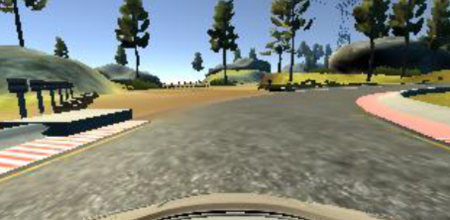

# Behavioral Cloning

For the Self-Driving Car Behaviorial Cloning project, a Convoluted Neural Network (CNN) is developed that can steer a car around a track in a simulator. We train the network by driving the car around the flat terrain track and taking pictures. The model is then validated on a new track for performing steering angle prediction. The resultant CNN will clone the human driving behavior.

The CNN will be built in Keras.

**Dependencies:**

This lab requires:

[CarND Term1 Starter Kit](https://github.com/udacity/CarND-Term1-Starter-Kit)
    
**Resources:**
   
* model.py: script to create and train the model
* drive.py: script to drive the car in autonomous mode
* model.h5: Trained CNN


**Unbalanced Data**

We record the loop by taking pictures using 3 front-facing cameras: left, center, right. 

The range of the steering angle is from -1 to 1 - the actualy steering angle are designated as the label of the image. The main issue lies with the skew of the dataset. Most of the data had steering angles of zero and since I drove the track only in one direction, the data was skewed to the left. This resulted in a problem for the CNN because it tended to drive straight and was confused with sharp turns.

Additionally, most of the time, I ended driving straight. 

Here is an augmentation trick used to improve the dataset:

**Horizontal Flip**

I randomly flipped the images horizontally and change signs on the steering angles to make left and right turns appear equally as often.

       


```python
flip_indices = random.sample(range(x.shape[0]), int(x.shape[0] / 2))
x[flip_indices] = x[flip_indices, :, ::-1, :]
y[flip_indices] = -y[flip_indices]
```


**Vertical Shear:** We cut out non-relevant top and bottom parts of the image such as the sky, trees and part of the hood.

The resultant cropped images were 66 x 200 (height x width)

Here's a histogram of the balanced dataset


# Installation

First make sure Conda is installed
Install Tensor Flow

Start up the simulator in autonomous mode, then run the model:

Drive.py requires saving the trained model as an h5 file. 

model.save(filepath)

Then we can use the model with drive.py

python drive.py model.h5

This command will load the trained model and make predictions on steering angle.
# Train the Model#

Using the data folder with the training images
python model.py
Started with the model mentioned in the [Nvidia paper.](https://arxiv.org/abs/1604.07316) - thankfully our model will be much simpler. 


**CNN**

For the CNN, I chose 4 convolutional layers with ReLU activations. The first three layers had 2x2 strides and 5x5 kernel. The 4th layer had a 1x1 stride and 3x3 kernel. 

Then 3 fully connected layer, and finally a single neuron from the output determined the steering angle. 

I avoided using pooling areas since this did not help keeping the car in the middle of the lane.

Image normalization
* Layer 1: Convolution: 5x5, filter: 24, strides: 2x2, activation: ELU
* Layer 2: Convolution: 5x5, filter: 36, strides: 2x2, activation: ELU
* Layer 3: Convolution: 5x5, filter: 48, strides: 2x2, activation: ELU
* Layer 4: Convolution: 3x3, filter: 64, strides: 1x1, activation: ELU

* Drop out (0.5)

* Layer 5: Fully connected: neurons: 100, activation: ELU
* Layer 6: Fully connected: neurons: 50, activation: ELU
* Layer 7: Fully connected: neurons: 10, activation: ELU
* Layer 8: Fully connected: neurons: 1 (output)

Outfitting was reduced by using a dropout of 0.5

The car manages to drive down the center of the track just fine.


The model encoded with Keras.  You can find the code in [model.py](https://github.com/RUNINDC/Behaviorial-Cloning/blob/master/model.py)


```python
# first convolutional layer
model.add(Convolution2D(24, 5, 5, subsample=(2,2)))
model.add(ELU())
model.add(Dropout(0.5))
# second convolutional layer
model.add(Convolution2D(36, 5, 5, subsample=(2,2)))
model.add(ELU())
model.add(Dropout(0.5))
# third convolutional layer
model.add(Convolution2D(48, 5, 5, subsample=(2,2)))
model.add(ELU())
model.add(Dropout(0.5))
# fourth convolutional layer
model.add(Convolution2D(64, 3, 3))
model.add(ELU())
model.add(Dropout(0.5))

model.add(Convolution2D(64, 3, 3))
model.add(ELU())
model.add(Dropout(0.5))

# flatten layer
model.add(Flatten())

# first fully connected layer
model.add(Dense(100))
# second fully connected layer
model.add(Dense(50))
# third fully connected layer
model.add(Dense(10))
# output layer of the predicted steering angle
model.add(Dense(1))

```

# Retrain the Model#

Learning rate parameters: 25 Epochs


```python
# training parameters
nb_epochs = 25

# side camera parameters
correction_factor = 0.17

# feedback
print("basic setup completed")

### helper functions
# adopted from example in classroom
def generator(lines_, batch_size=32):
	num_samples = len(lines_)
	while 1:
		shuffle(lines_)
		for offset in range(0, num_samples, batch_size):
			batch_samples = lines_[offset:offset+batch_size]

			images = []
			angles = []
			for batch_sample in batch_samples:
				# read data
				center_name  = RAW_DATA_PATH+'IMG/'+batch_sample[0].split('/')[-1]
				center_image = cv2.imread(center_name)
				center_angle = float(batch_sample[3])
				
				left_name = RAW_DATA_PATH+'IMG/'+batch_sample[1].split('/')[-1]
				left_image = cv2.imread(left_name)
				left_angle = center_angle+correction_factor

				right_name = RAW_DATA_PATH+'IMG/'+batch_sample[2].split('/')[-1]
				right_image = cv2.imread(right_name)
				right_angle = center_angle-correction_factor

				# store original data
				images.append(center_image)
				images.append(left_image)
				images.append(right_image)
				angles.append(center_angle)
				angles.append(left_angle)
				angles.append(right_angle)

				# mirror data (flip)
				flipped_center_image = cv2.flip(center_image, 1)
				flipped_left_image = cv2.flip(left_image, 1)
				flipped_right_image = cv2.flip(right_image, 1)
				flipped_center_angle = center_angle * -1
				flipped_left_angle = left_angle * -1
				flipped_right_angle = right_angle * -1
				# store flipped data
				images.append(flipped_center_image)
				images.append(flipped_left_image)
				images.append(flipped_right_image)
				angles.append(flipped_center_angle)
				angles.append(flipped_left_angle)
				angles.append(flipped_right_angle)
				
			# convert to numpy array
			X_train = np.array(images)
			y_train = np.array(angles)
			yield sklearn.utils.shuffle(X_train, y_train)
```

I added a Dropout of 0.5 to prevent overfitting

Drive.py takes in a constant stream of images and passes the image array to the model which predicts the steering angle.

The steering angle is then passed to the car so that it can steer by itself.


Here is the full output video: [Drive video](https://youtu.be/cfvn01nmSIs)

